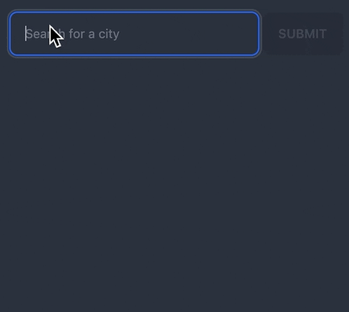
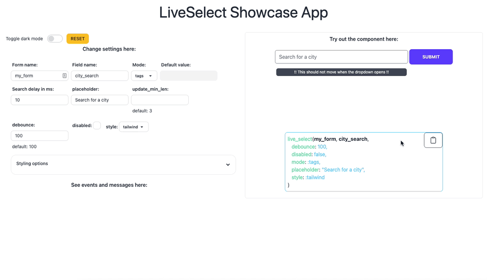

# LiveSelect

[](https://hex.pm/packages/live_select)
[](https://github.com/maxmarcon/live_select/actions/workflows/elixir.yml)

Dynamic search and selection component for LiveView.

`LiveSelect` is a LiveView component that implements a search and selection
field with content provided dynamically by your application. It comes with reasonable default styles
that use [DaisyUI](https://daisyui.com/). The default styles can be either extended or completely overridden.




## Installation

To install, add this to your dependencies:

```
[
    {:live_select, "~> 0.1.0"}
]
```

## Javascript Hooks

`LiveSelect` relies on Javascript hooks to work. You need to add `LiveSelect`'s hooks to your live socket.

In your `app.js` file:

```
import live_select from "live_select"

// if you don't have any other hooks:
let liveSocket = new LiveSocket("/live", Socket, {params: {_csrf_token: csrfToken}, hooks: live_select})


// if you have other hooks:
const hooks = {
    MyHook: {
      // ...
    },
    ...live_select
}
let liveSocket = new LiveSocket("/live", Socket, {params: {_csrf_token: csrfToken}, hooks})
```

## Styling

For the time being, `LiveSelect` supports 2 styling options: styling with [daisyUI](https://daisyui.com/) or custom styling. The choice
of styling is controlled using the `style` option in `LiveSelect.live_select/3`.

Support for vanilla Tailwind styles is planned for the future.

If you use daisyUI styles, you need to install daisyUI. If you're already using Tailwind, this is as simple as [adding an additional plugin](https://daisyui.com/docs/install/) to your `tailwind.config.js`
Moreover, in order for Tailwind to see the daisyUI classes used by `LiveSelect`, you need to add one of the following lines to the `content` section in your `tailwind.config.js`:

```
module.exports = {
    content: [
        //...
        '../deps/live_select/lib/live_select/component.*ex' <-- for a standalone app
        '../../../deps/live_select/lib/live_select/component.*ex' <-- for an umbrella app
    ]
    //..
}
```

(Notice the different paths for a standalone or umbrella app)

That's it! Now your `LiveSelect` component will use pre-configured daisyUI styles.

## Showcase app

The repository includes a showcase app you can use to play around with the different options and parameters for `LiveSelect`.
To start the showcase app, simply run:

```
mix setup
PORT=4001 mix phx.server
```

from within the cloned repository. The app will be available at http://localhost:4001.
The showcase app shows the messages and events that your LiveView receives. For each event or message, the app shows function head
of the callback that your LiveView needs to implement in order to handle the event.




This allows you to quickly copy and paste the function definition into your live view.

Note that the showcase app uses the following styling options:

```elixir
[
    container_extra_class: "w-full",
    dropdown_extra_class: "w-full bg-base-200 p-2",
    text_input_extra_class: "w-full"
]
```

See [live_select/3](https://hexdocs.pm/live_select/LiveSelect.html#live_select/3) for details.

## Usage

Refer to the [online documentation](https://hexdocs.pm/live_select/LiveSelect.html).

## TODO

 - [X] Add `package.json` to enable `import live_select from "live_select"`
 - [X] Make sure component classes are included by tailwind 
 - [X] Enable custom styling 
 - [X] Rename LiveSelect.render to live_select
 - [X] Customizable placeholder
 - [ ] Enable slots to customize the appearance of the options, for example to implement type ahead hints
 - [ ] Add support for vanilla tailwind styles
 - [ ] Enable configuring different styles in the showcase app
